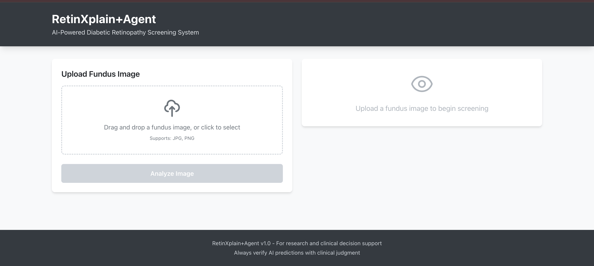
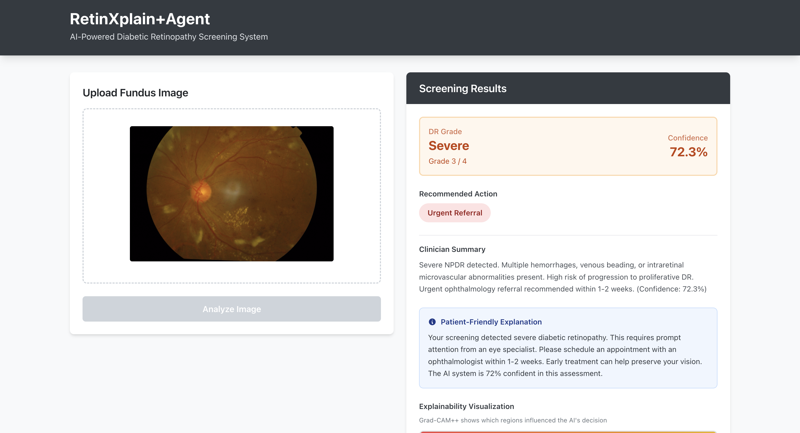
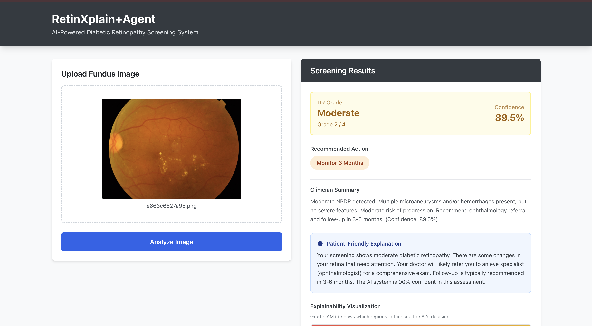
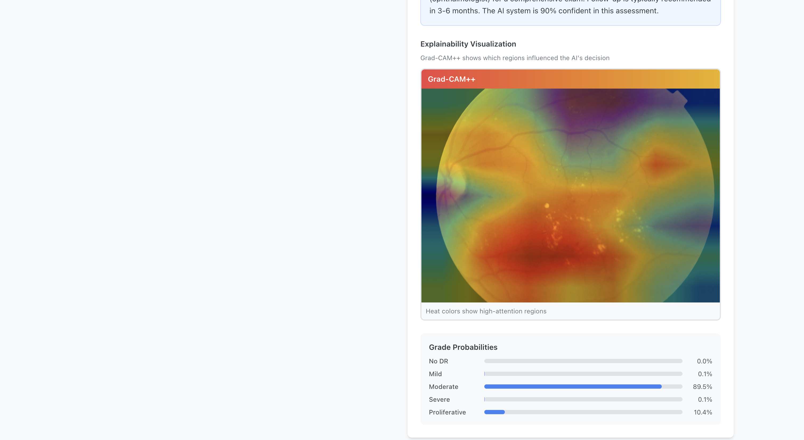

# RetinXplain

AI-Powered Diabetic Retinopathy (DR) Screening System with Explainability

RetinXplain is a comprehensive deep learning system for automated diabetic retinopathy classification from fundus images. It provides accurate DR grading (0-4) along with Grad-CAM++ explainability visualizations to help clinicians understand model predictions.

## Features

- **DR Classification**: 5-class classification (No DR, Mild, Moderate, Severe, Proliferative DR)
- **Explainability**: Grad-CAM visualization overlays showing model attention
- **Modern Web Interface**: React-based frontend with drag-and-drop image upload
- **RESTful API**: FastAPI backend with automatic documentation
- **LLM Explanations**: AI-generated text explanations of predictions (optional)
- **Feedback System**: Collect and log user feedback for model improvement

## Screenshots

### Main Interface



The clean, modern interface for uploading fundus images with drag-and-drop support.

### Screening Results



Example screening results showing Moderate DR (Grade 2/4) with 89.5% confidence, including clinician summary and patient-friendly explanation.




Example screening results showing Severe DR (Grade 3/4) with urgent referral recommendation, and Moderate DR (Grade 2/4) with a recommendation to monitor for 3 months. 

### Explainability Visualization



Grad-CAM heatmap overlay showing which regions of the fundus image influenced the AI's decision. Red/orange/yellow areas indicate high attention regions, while blue/purple areas show lower attention.

## Project Structure

```
retinxplain/
├── src/                    # Python backend
│   ├── api/               # FastAPI endpoints
│   ├── inference/         # Model loading, prediction, explainability
│   ├── data/              # Image preprocessing and transforms
│   └── utils/             # Utilities (image I/O, logging)
├── frontend/              # React frontend
│   ├── src/
│   │   ├── components/    # React components
│   │   └── App.jsx        # Main app component
│   └── package.json
├── Notebooks/             # Jupyter notebooks for model training/experimentation
├── models/                # Trained model weights (not in git)
└── uploads/               # Uploaded images and generated overlays (not in git)
```

## Quick Start

### Prerequisites

- Python 3.11+
- Node.js 18+ and npm/yarn
- PyTorch (CPU or GPU/MPS)

### Backend Setup

1. **Install dependencies:**
   ```bash
   pip install -r requirements.txt
   ```

2. **Set up environment variables:**
   ```bash
   cp .env.example .env
   # Edit .env with your API keys if using LLM explainer
   ```

3. **Place model weights:**
   - Download or train the ResNet50 model
   - Place `resnet50_best_cleaned.pt` in `models/` directory

4. **Start backend server:**
   ```bash
   uvicorn src.api.main:app --reload --port 8000
   ```

   The API will be available at `http://localhost:8000`
   - API docs: `http://localhost:8000/docs`
   - Health check: `http://localhost:8000/health`

### Frontend Setup

1. **Navigate to frontend directory:**
   ```bash
   cd frontend
   ```

2. **Install dependencies:**
   ```bash
   npm install
   ```

3. **Start development server:**
   ```bash
   npm run dev
   ```

   The frontend will be available at `http://localhost:5000`

### Usage

1. Open the web interface at `http://localhost:5000`
2. Upload a fundus image (drag & drop or click to select)
3. View the prediction results:
   - DR grade and confidence
   - Probability distribution across all classes
   - Grad-CAM++ explainability overlay
   - AI-generated text explanation (if configured)
4. Provide feedback on the prediction quality

## API Endpoints

### `POST /api/dr/predict`

Predict DR classification from a fundus image.

**Request:**
- Method: `POST`
- Content-Type: `multipart/form-data`
- Body: `file` (image file)

**Response:**
```json
{
  "pred_class_idx": 2,
  "pred_class_name": "Moderate",
  "confidence": 0.87,
  "probs": [0.05, 0.08, 0.87, 0.00, 0.00],
  "artifacts": {
    "original_image_path": "2024-01-15/abc123_original.png",
    "gradcam_overlay_path": "2024-01-15/abc123_gradcam.png"
  }
}
```

### `GET /health`

Health check endpoint.

**Response:**
```json
{
  "status": "ok"
}
```

## Model Details

- **Architecture**: ResNet50
- **Input Size**: 224x224 (resized from 256x256 with center crop)
- **Classes**: 5 DR severity levels (0-4)
- **Normalization**: ImageNet statistics
- **Device Support**: CPU, CUDA (GPU), MPS (Apple Silicon)

## Explainability Methods

**Grad-CAM (Gradient-weighted Class Activation Mapping)**: Our custom implementation generates heatmaps showing important regions that influenced the model's prediction. The visualization uses a color gradient from blue (low attention) to red/yellow (high attention), allowing clinicians to understand which areas of the fundus image were most significant for the DR classification.


## Development

### Backend Development

```bash
# Run with auto-reload
uvicorn src.api.main:app --reload
```

### Frontend Development

```bash
cd frontend
npm run dev      # Development server
npm run build    # Production build
npm run preview  # Preview production build
```

## Configuration

Key configuration in `src/config.py`:
- Model path
- Image preprocessing parameters
- Device selection (auto-detects MPS/CUDA/CPU)
- Class names and mappings

## Environment Variables

See `.env.example` for required environment variables:
- LLM API keys (if using LLM explainer)
- Other service configurations

## License

This project is licensed under the MIT License - see the LICENSE file for details.

## Acknowledgments

- **PyTorch** and **torchvision** for the deep learning framework and pre-trained models
- **FastAPI** for the modern, fast web framework
- **React** and **Vite** for the frontend framework and build tool
- **Grad-CAM** library for explainability implementations
- The medical imaging and deep learning research community for foundational work in diabetic retinopathy classification
